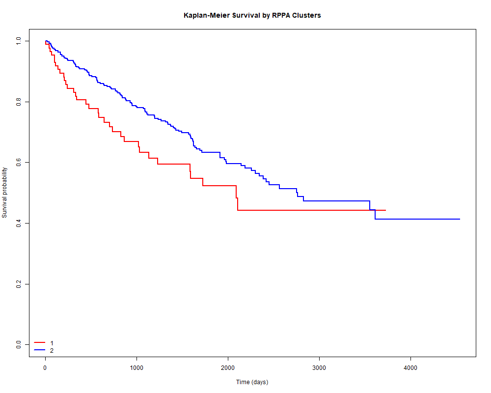

# TCGA-KIRC Multi-Omics Survival Stratification



*Kaplan-Meier survival curves showing distinct outcomes between proteomic-defined tumor subgroups.*

---

## Project Overview

This project explores clear cell renal cell carcinoma (ccRCC) using a multi-omics strategy integrating:

- clinical survival data
- RNA-seq transcriptomics
- RPPA proteomics

The central question was clinically and biologically relevant:

**Can proteomic tumor patterns identify patient subgroups with different survival outcomes, and are these patterns supported at the transcriptomic level?**

---

## Key Findings

- Two proteomic tumor clusters were identified in the matched TCGA-KIRC cohort
- Cluster 1 showed a higher event rate and a less favorable survival profile
- Multi-omics integration identified concordant markers across proteomic and transcriptomic layers
- The higher-risk subgroup was characterized by signals related to cell cycle activation, DNA damage response, apoptosis regulation, and metabolic adaptation
- These findings support the existence of biologically distinct ccRCC subgroups with prognostic relevance

---

## Clinical Context

Clear cell renal cell carcinoma (ccRCC) is a biologically heterogeneous malignancy.  
Patients with similar clinical stage can experience markedly different outcomes, suggesting that standard clinicopathologic variables do not fully capture tumor behavior.

Multi-omics profiling offers an opportunity to define biologically meaningful tumor subgroups linked to prognosis and potentially relevant therapeutic vulnerabilities.

---

## Data Sources

Data were obtained from the TCGA PanCancer Atlas and filtered to kidney renal clear cell carcinoma (KIRC):

- RNA-seq expression data
- RPPA proteomic profiles
- curated clinical survival data

### Final cohort

- 537 patients with clinical data
- 475 patients with matched multi-omics data

---

## Study Design

This project followed a proteomics-first stratification strategy:

1. extract KIRC samples from PanCancer resources
2. harmonize identifiers across clinical, RNA-seq, and RPPA datasets
3. construct a matched multi-omics cohort
4. identify proteomic patient subgroups using PCA and K-means clustering
5. compare survival outcomes between clusters
6. characterize cluster-specific proteomic and transcriptomic differences
7. identify concordant cross-layer markers

---

## Methods

### Proteomic Stratification

- median imputation of missing RPPA values
- variance filtering
- principal component analysis (PCA)
- K-means clustering on PCA-derived features

### Survival Analysis

- Kaplan-Meier survival analysis by cluster
- event comparison across proteomic-defined groups

### Differential Analysis

- RPPA differential analysis between clusters
- RNA-seq differential analysis between clusters
- false discovery rate correction

### Multi-Omics Integration

- mapping of proteins to gene symbols
- cross-layer concordance analysis
- identification of markers showing consistent directionality across omics layers

---

## Results

### Proteomic Clustering

Two major proteomic clusters were identified:

- Cluster 1: 86 patients
- Cluster 2: 389 patients

This suggests the presence of a smaller but biologically distinct subgroup within ccRCC.

### Survival Differences

Cluster 1 showed a higher event rate and a less favorable survival pattern:

- Cluster 1: ~39% events
- Cluster 2: ~34% events

Although moderate, this difference supports the clinical relevance of proteomic subgrouping.

### Multi-Omics Concordance

A set of concordant markers was identified across RPPA and RNA-seq layers.

Representative signals in the higher-risk subgroup included:

#### Cell cycle activation
- CCNE1
- CCNB1

#### DNA damage response
- CHEK2
- RAD51

#### Apoptosis regulation
- BAK1
- BCL2L1
- DIABLO

#### Growth and metabolism
- IGFBP2
- ASNS
- TFRC

### Biological Interpretation

The higher-risk cluster showed a molecular profile consistent with:

- increased proliferative signaling
- enhanced DNA repair activity
- dysregulated apoptosis
- metabolic adaptation

Together, these features support a more aggressive tumor phenotype and provide a mechanistic explanation for the observed survival differences.

---

## Key Output Files

### Clinical
- `results/clinical/clinical_summary.tsv`
- `results/clinical/stage_distribution.tsv`
- `results/clinical/grade_distribution.tsv`

### Clustering
- `results/clustering/rppa_cluster_sizes.tsv`
- `results/clustering/rppa_pca_clusters.tsv`
- `results/clustering/rppa_pca_clusters.png`

### Survival
- `results/survival/kaplan_meier_by_cluster.png`
- `results/survival/survival_cluster_counts.tsv`

### Differential
- `results/differential/rppa_differential.tsv`
- `results/differential/rnaseq_differential.tsv`
- `results/differential/top_cluster1_genes.tsv`
- `results/differential/top_cluster2_genes.tsv`
- `results/differential/top_cluster1_proteins.tsv`
- `results/differential/top_cluster2_proteins.tsv`

### Integration
- `results/integration/multiomics_concordance.tsv`
- `results/integration/top_concordant_cluster1.tsv`
- `results/integration/multiomics_coverage.tsv`

---

## Why This Project Matters

This repository demonstrates:

- real multi-omics integration using public cancer data
- clinically interpretable subgroup discovery
- survival-oriented translational analysis
- cross-layer validation between proteomic and transcriptomic findings
- a structured workflow relevant to precision oncology and kidney cancer research

---

## Project Structure

```text
.
├── data/
│   ├── raw/
│   ├── metadata/
│   └── processed/
├── docs/
├── results/
│   ├── clinical/
│   ├── clustering/
│   ├── differential/
│   ├── enrichment/
│   ├── integration/
│   ├── proteomics/
│   ├── rnaseq/
│   └── survival/
├── scripts/
│   ├── 01_download_tcga_data.R
│   ├── 02_prepare_pancan_data.R
│   ├── 03_prepare_clinical_data.R
│   ├── 04_prepare_rnaseq_data.R
│   ├── 05_clean_clinical_survival.R
│   ├── 06_build_rnaseq_matrix.R
│   ├── 07_match_multiomics_cohort.R
│   ├── 08_survival_by_cluster.R
│   ├── 09_rppa_differential_analysis.R
│   ├── 10_rnaseq_differential_by_cluster.R
│   └── 11_multiomics_integration.R
└── README.md

## Reproducibility :

Requirements

This project was developed in R.

Core packages used include:

dplyr
readr
ggplot2
survival
survminer
stats

## Execution Order :

-source("scripts/01_download_tcga_data.R")
-source("scripts/02_prepare_pancan_data.R")
-source("scripts/03_prepare_clinical_data.R")
-source("scripts/04_prepare_rnaseq_data.R")
-source("scripts/05_clean_clinical_survival.R")
-source("scripts/06_build_rnaseq_matrix.R")
-source("scripts/07_match_multiomics_cohort.R")
-source("scripts/08_survival_by_cluster.R")
-source("scripts/09_rppa_differential_analysis.R")
-source("scripts/10_rnaseq_differential_by_cluster.R")
-source("scripts/11_multiomics_integration.R")

## Main deliverables : 

proteomic cluster definition
Kaplan-Meier survival comparison
differential RPPA and RNA-seq results
concordant multi-omics markers linked to prognosis

## Limitations : 

no external validation cohort
survival differences are moderate rather than extreme
no mutation or copy-number layer included
findings remain hypothesis-generating without independent replication

## Future Directions :

pathway enrichment analysis for cluster-specific markers
external validation in independent ccRCC cohorts
integration with mutation and copy-number data
development of prognostic multi-marker scores

## Author

Cristian Arias, MD
Nephrologist | Healthcare Data Scientist | Bioinformatics